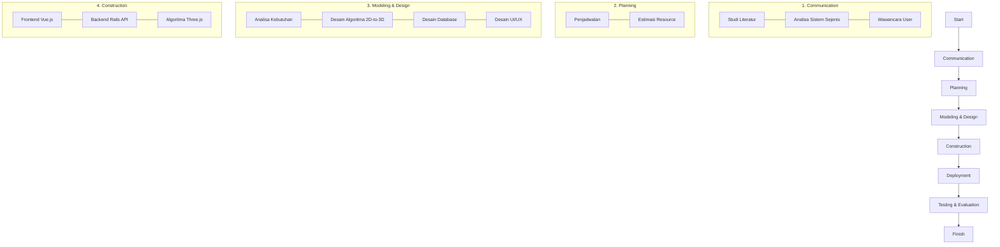
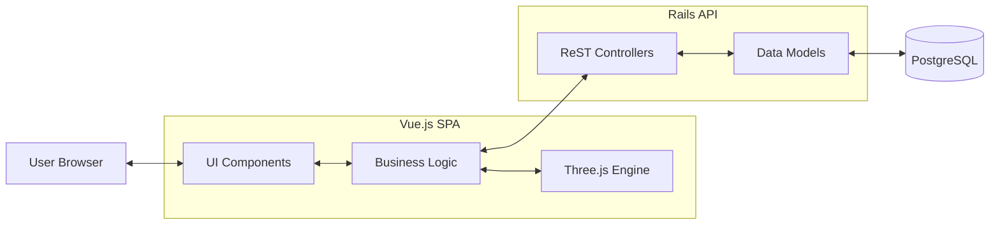

Judul: 2D-TO-3D GRID-BASED EXTRUSION ALGORITHM FOR WEB-BASED NIRMANA TRIMATRA MODELING

-------
# Abstrak
Pembelajaran Nirmana Trimatra (3D) dalam desain visual sering kali terkendala oleh metode tradisional “paku dan papan” yang membatasi fleksibilitas, kecepatan eksplorasi, serta membutuhkan biaya dan waktu yang signifikan. Penelitian ini bertujuan mengembangkan aplikasi web interaktif berbasis JavaScript, Vue.js, dan Three.js untuk mensimulasikan proses pembuatan Nirmana 3D secara digital, sehingga mahasiswa dapat memvisualisasikan, memanipulasi, dan menyimpan desain tanpa keterbatasan fisik. Metodologi pengembangan menggunakan model waterfall, meliputi tahap komunikasi, perencanaan, perancangan antarmuka, konstruksi aplikasi, serta pengujian. Fitur utama meliputi 2D Studio, 3D Studio, pengaturan papan dan paku, serta penyimpanan desain dalam format JSON pada database PostgreSQL. Uji coba dilakukan kepada mahasiswa Desain Komunikasi Visual melalui kuesioner, wawancara, dan uji fungsionalitas. Hasilnya menunjukkan bahwa aplikasi mampu meningkatkan pemahaman konsep spasial, mempercepat iterasi desain, serta memberikan fleksibilitas eksplorasi bentuk. Responden juga menilai positif akses berbasis web yang memudahkan penggunaan lintas perangkat tanpa instalasi tambahan. Simpulan penelitian menegaskan bahwa aplikasi ini tidak hanya menjadi media pembelajaran efektif, tetapi juga mendukung pemerataan akses edukasi desain melalui eliminasi hambatan biaya dan material, serta relevan dengan kebutuhan industri kreatif modern

Kata Kunci: Nirmana Trimatra, Visualisasi 3D, Three.js, Aplikasi Web, Desain Visual

-------
# KATA PENGANTAR
Puji syukur ke hadirat Tuhan Yang Maha Esa atas rahmat dan karunia-Nya, sehingga skripsi ini dapat diselesaikan dengan baik. Skripsi dengan judul "ALGORITMA EKSTRUSI BERBASIS GRID 2D-KE-3D UNTUK PEMODELAN NIRMANA TRIMATRA BERBASIS WEB" ini disusun sebagai salah satu syarat untuk memperoleh gelar Sarjana Komputer pada Program Studi Computer Science, BINUS Online.
Dalam penyusunan skripsi ini, penulis banyak mendapatkan bimbingan, dukungan, dan bantuan dari berbagai pihak. Oleh karena itu, dengan segala kerendahan hati, penulis menyampaikan ucapan terima kasih yang tulus kepada:
Dr. Nelly, S.Kom., M.M., selaku rektor Universitas Bina Nusantara.
Immanuela Puspasari Saputro, S.Si., M.T., selaku Head of Computer Science Study Program BINUS Online Learning.
Dr. Emmy Harna Yossy, S.Kom., M.T.I., selaku Pembimbing Skripsi, atas kesabaran, waktu, ilmu, serta arahan yang berharga dari awal hingga akhir penyusunan skripsi ini.
Keluarga tercinta, Ayah, Ibu, dan seluruh anggota keluarga, atas doa, dukungan moral, materi, dan kasih sayang yang tak terhingga.
Semua pihak yang tidak dapat disebutkan satu per satu, atas segala bantuan, masukan, dan motivasi yang telah diberikan selama proses penyusunan skripsi ini.
Penulis menyadari bahwa skripsi ini masih jauh dari sempurna. Oleh karena itu, kritik dan saran yang membangun sangat diharapkan demi perbaikan di masa mendatang. Semoga skripsi ini dapat memberikan manfaat dan kontribusi bagi pengembangan ilmu pengetahuan, khususnya dalam bidang desain visual dan teknologi informasi.

-------
# DAFTAR ISI

HALAMAN JUDUL	1
HALAMAN SAMPUL	1
ABSTRAK	2
KATA PENGANTAR	4
DAFTAR ISI	5
DAFTAR TABEL	6
DAFTAR GAMBAR	7
DAFTAR LAMPIRAN	8
BAB 1	9
PENDAHULUAN	9
1.1. Latar Belakang Masalah	9
1.2. Rumusan Masalah	12
1.3. Tujuan Penelitian	13
1.4. Manfaat Penelitian	13
1.5. Ruang Lingkup Penelitian	14
BAB 2	17
TINJAUAN PUSTAKA	17
2.1. Landasan Teori	17
2.1.1. Nirmana	17
2.1.2. Visualisasi 3D dalam Desain	17
2.1.3. Aplikasi Berbasis Web untuk Desain (Three.js)	19
2.2. Kerangka Pemikiran	21
2.3. Studi Terkait dan Research Gap	22
2.3.1 Penelitian Terkait	23
2.3.2 Research Gap	25
BAB 3	26
METODOLOGI PENELITIAN	26
3.1 Tahapan Penelitian	26
3.2 Analisa Permasalahan	26
3.2.1 Analisa Sistem Berjalan Atau Sistem Sejenis	26
3.2.2 Analisa Kebutuhan	28
3.2.3 Usulan Pemecahan Masalah	29
3.3 Perancangan Sistem	30
3.3.1 Deskripsi Sistem	30
3.3.2 Fungsi Sistem	30
3.3.3 Rancangan Sistem	31
3.4 Perancangan Database	32
3.5 Perancangan User Interface	33
3.6 Perancangan Evaluasi	34
BAB IV	63
HASIL DAN PEMBAHASAN	63
4.1 Spesifikasi Sistem	63
4.2 Prosedur Penggunaan Aplikasi	63
4.2.1 Home	63
4.2.2 Sign Up	64
4.2.3 Forgot Password	65
4.2.4 Sign In	65
4.2.5 Edit Profile	66
4.2.6 View Profile	67
4.2.7 2D Studio	68
4.2.8 3D Studio	69
4.2.9 Board Control Panel	69
4.2.10 Nail Control Panel	70
4.2.11 Save Project	72
4.3 Testing	72
4.3.1 Metode Pengujian	72
4.3.2 Instrumen Kuesioner Pengujian	73
4.4 Evaluasi	74
4.4.1 Pengujian Fungsional dengan Blackbox	74
4.4.2 Pengujian Berbasis User Acceptance (UAT)	75
BAB V	76
SIMPULAN DAN SARAN	76
5.1 Simpulan	76
5.2 Saran	76
DAFTAR PUSTAKA	77


-------
BAB 1 - PENDAHULUAN
1.1. Latar Belakang Masalah 
Konversi data struktur 2D menjadi representasi visual 3D merupakan permasalahan fundamental dalam computer graphics dan visualisasi berbasis web. Tantangan utama meliputi transformasi koordinat diskrit pada grid 2D (x, y) ke sistem koordinat spasial 3D (x, y, z), pengelolaan atribut geometris seperti tinggi (height), lebar (width), dan skala objek, serta optimasi rendering untuk menampilkan ratusan hingga ribuan objek secara simultan tanpa degradasi performa. Dalam konteks aplikasi desain visual seperti Nirmana Trimatra—yang mensimulasikan penataan paku pada papan dengan variasi tinggi dan ketebalan—kompleksitas bertambah dengan kebutuhan interaksi real-time (rotasi, zoom, pan) dan akurasi representasi spasial yang tinggi.

Metode konversi 2D-to-3D konvensional sering menggunakan pendekatan vertex-by-vertex atau mesh generation yang memerlukan komputasi intensif dan kurang efisien untuk objek repetitif dengan geometri seragam. Menurut Chen (2024), rendering model 3D berbasis WebGL menghadapi bottleneck pada operasi transformasi individual untuk setiap objek, dengan response time mencapai 200-300ms untuk 1000+ objek jika tidak dioptimasi. Pendekatan tradisional juga menghasilkan grid yang tidak terpusat pada origin (0,0,0), menyebabkan kesulitan dalam navigasi kamera dan rotasi yang tidak natural. Sebagai contoh, grid 20×20 dengan formula konversi standar `pos = gridCoord × spacing` akan menghasilkan koordinat dari (0,0) hingga (19,19), yang secara visual terletak di kuadran positif saja dan memerlukan offset manual untuk centering.

Permasalahan spesifik yang diidentifikasi dalam penelitian ini meliputi:
1. **Transformasi Koordinat yang Tidak Efisien**: Konversi grid 2D ke 3D sering tidak menghasilkan objek yang terpusat pada origin, mempersulit operasi kamera dan rotasi orbital.
2. **Overhead Rendering untuk Objek Repetitif**: Pembuatan mesh terpisah untuk setiap objek (misalnya 1000 paku) mengakibatkan draw calls berlebihan dan frame rate drop.
3. **Kompleksitas Transformasi Multi-Atribut**: Mengatur posisi, skala (tinggi/lebar), dan rotasi objek secara terpisah memerlukan multiple function calls yang tidak efisien.
4. **Kurangnya Dokumentasi Algoritma Konversi**: Implementasi Three.js/WebGL sering bersifat black-box tanpa penjelasan matematis yang jelas tentang pipeline transformasi.

Penelitian ini mengusulkan solusi berbasis **grid-based extrusion algorithm** dengan komponen utama: (1) sistem koordinat terbalik (reversed coordinate system) untuk centering otomatis, (2) InstancedMesh untuk rendering geometri seragam dengan efisiensi tinggi, dan (3) transformasi berbasis Matrix4 yang menggabungkan scale, translation, dan positioning dalam single operation. Pendekatan ini tidak hanya mengatasi limitasi teknis tetapi juga menyediakan framework yang dapat direplikasi untuk aplikasi visualisasi 3D berbasis web lainnya.  
Penerapan visualisasi 3D dalam pendidikan desain menawarkan solusi transformatif untuk mengatasi kendala ini. Alat 3D memfasilitasi pemahaman spasial yang lebih dalam, khususnya untuk Nirmana Trimatra (3D) yang memerlukan pertimbangan kedalaman, volume, dan bentuk. Metode manual kesulitan merepresentasikan dan memanipulasi objek 3D secara efektif. Sebaliknya, lingkungan digital mendorong eksperimen cepat dan proses desain iteratif, memungkinkan mahasiswa mengeksplorasi berbagai konsep artistik dan variasi komposisi dengan kecepatan dan fleksibilitas yang belum pernah ada. Kemampuan memanipulasi elemen 3D secara instan meningkatkan pemahaman teoritis Nirmana dan memperkaya pengalaman belajar. Adopsi teknologi 3D ini juga langsung mempersiapkan mahasiswa untuk alat dan alur kerja profesional. Menurut Dere & Kalelioglu (2020), penggunaan environment desain 3D berbasis web secara signifikan meningkatkan kemampuan visualisasi spasial dan rotasi mental siswa, dengan peningkatan skor tes yang mencakup visualisasi lintas-seksi objek, menunjukkan potensi transformatif teknologi ini dalam pengembangan keterampilan spasial. 
Transformasi desain dari 2D ke 3D dalam lingkungan digital didasarkan pada prinsip-prinsip geometris dan komputasi canggih, melibatkan konversi data planar menjadi representasi spasial. Proses ini melibatkan perhitungan matematis rumit untuk memproyeksikan dan memanipulasi objek 3D, seringkali menggunakan perkalian matriks untuk mengubah properti objek secara dinamis seperti rotasi, skala, dan translasi. Aplikasi berbasis web yang diusulkan akan memanfaatkan prinsip ini untuk mengubah desain grid 2D menjadi tampilan 3D interaktif, mensimulasikan penataan paku pada papan dengan berbagai ukuran dan ketebalan. Mahasiswa dapat "membangun" komposisi 3D secara virtual, melihat dari berbagai sudut, dan melakukan penyesuaian instan. Pendekatan ini mereplikasi pengalaman taktil dan melampauinya dengan eksplorasi skenario tak terbatas tanpa batasan material atau waktu. Integrasi simulasi paku ini memungkinkan representasi visual akurat tentang bagaimana perubahan elemen 2D diterjemahkan ke bentuk 3D, memperdalam pemahaman hubungan antar dimensi, menjadikannya alat pedagogis yang kuat.  
Aplikasi berbasis web ini akan menjadi aset tak ternilai bagi mahasiswa Desain Komunikasi Visual (DKV) untuk visualisasi desain yang lebih efisien dan interaktif. Manfaat utamanya meliputi peningkatan pemahaman spasial, kemampuan eksperimen yang dipercepat tanpa batasan fisik, dan pengembangan keterampilan digital yang relevan dengan industri. Mahasiswa dapat melihat dan memanipulasi desain dalam 3D, memutar, memperbesar, dan mengubah perspektif dengan mudah, memungkinkan pemahaman intuitif tentang interaksi elemen 3D. Proses iteratif yang cepat mendorong eksplorasi berani tanpa takut kesalahan atau pemborosan material. Lebih dari sekadar alat bantu, platform ini juga mengembangkan kompetensi abad ke-21 seperti berpikir komputasi, pemecahan masalah digital, dan kolaborasi virtual. Menurut Zheng et al. (2024), integrasi platform simulasi virtual dalam kurikulum teknik berkorelasi langsung dengan peningkatan minat belajar, tingkat keterampilan, dan daya saing mahasiswa di pasar kerja melalui peningkatan skor kursus dan partisipasi kompetisi.  
Selain manfaat pedagogis dan pengembangan keterampilan, aplikasi ini berpotensi mendemokratisasi akses ke eksplorasi desain tingkat lanjutan. Dengan menghilangkan batasan fisik dan biaya material metode "paku dan papan" tradisional, mahasiswa dari berbagai latar belakang ekonomi akan memiliki kesempatan yang sama untuk bereksperimen dan mengembangkan kemampuan desain 3D. Tidak ada lagi kekhawatiran biaya material yang sering menjadi hambatan finansial, membuka pintu bagi kreativitas dan inovasi yang lebih luas. Platform digital ini juga meningkatkan aksesibilitas, memungkinkan pembelajaran kapan saja dan di mana saja, yang krusial dalam lingkungan pendidikan modern dengan model pembelajaran hibrida atau jarak jauh. Kemampuan berbagi dan mengulas karya secara digital akan meningkatkan kolaborasi antar mahasiswa dan instruktur, menciptakan ekosistem pembelajaran yang dinamis dan interaktif. Dampak sosial demokratisasi ini signifikan, karena dapat menumbuhkan generasi desainer yang lebih beragam dan inklusif, memperkaya lanskap desain secara keseluruhan. Dengan demikian, aplikasi ini tidak hanya alat pendidikan tetapi juga katalisator untuk perubahan positif dalam aksesibilitas dan kesetaraan pendidikan desain. 
Mengingat potensi besar teknologi digital dalam pendidikan desain, pengembangan aplikasi web untuk simulasi Nirmana Trimatra menjadi sangat relevan dan mendesak. Tantangan dalam mengimplementasikan prinsip Nirmana secara mendalam dan fleksibel dalam kurikulum konvensional memerlukan solusi inovatif. Aplikasi ini tidak hanya mengatasi keterbatasan fisik metode tradisional tetapi juga memberikan pengalaman belajar yang lebih menarik, interaktif, dan relevan dengan kebutuhan industri. Fokus pada simulasi "paku dan papan" secara digital, dengan kemampuan memanipulasi berbagai parameter, akan memastikan esensi Nirmana tetap terjaga, sementara fleksibilitas eksplorasi ditingkatkan secara eksponensial. Selain itu, dengan menyediakan platform yang memungkinkan peralihan mudah antara tampilan 2D dan 3D, aplikasi ini akan membantu mahasiswa memahami hubungan fundamental antara gambar datar dan representasi spasial. Tujuannya adalah memberdayakan mahasiswa DKV dengan alat yang memungkinkan mereka menguasai Nirmana Trimatra secara lebih efektif, mengembangkan keterampilan digital esensial, dan mempersiapkan karier sukses di bidang desain yang terus berkembang. Penelitian oleh Chen (2024) menunjukkan bahwa interaksi real-time model 3D berbasis web secara signifikan meningkatkan efisiensi rendering dan pengalaman pengguna, memperkuat argumen untuk pengembangan platform semacam ini.

1.2. Rumusan Masalah 
Berdasarkan latar belakang diatas, maka rumusan masalah dari penelitian ini adalah: 
  1. Bagaimana merancang algoritma konversi grid 2D-to-3D yang menghasilkan objek terpusat pada origin dengan transformasi koordinat yang efisien?
  2. Bagaimana mengimplementasikan pipeline transformasi berbasis Matrix4 dan InstancedMesh untuk rendering optimal ratusan hingga ribuan objek 3D secara simultan?
  3. Bagaimana performa algoritma ekstrusi berbasis grid dalam hal frame rate, response time interaksi, dan akurasi transformasi koordinat dibandingkan dengan metode konvensional?
  4. Bagaimana efektivitas visualisasi 3D hasil algoritma dalam mendukung pemahaman konsep spasial pada aplikasi pembelajaran Nirmana Trimatra?

1.3. Tujuan Penelitian 
Penelitian ini dilakukan bertujuan untuk:
  1. Merancang dan mengimplementasikan algoritma ekstrusi berbasis grid (grid-based extrusion algorithm) yang mentransformasi data struktur 2D menjadi representasi visual 3D dengan sistem koordinat terbalik (reversed coordinate system) untuk centering otomatis pada origin.
  2. Mengembangkan pipeline transformasi berbasis Matrix4 dan teknik InstancedMesh untuk optimasi rendering objek 3D repetitif pada aplikasi web berbasis Three.js/WebGL.
  3. Mengevaluasi performa algoritma melalui metrik kuantitatif (frame rate, response time, memory usage) dan validasi akurasi transformasi koordinat.
  4. Mendemonstrasikan aplikabilitas algoritma pada domain pembelajaran Nirmana Trimatra sebagai use case, dengan evaluasi efektivitas visualisasi 3D terhadap pemahaman konsep spasial mahasiswa DKV.
  5. Menyediakan dokumentasi algoritma komprehensif dan standalone demonstration code sebagai technical reference untuk replikasi dan pengembangan lebih lanjut. 

1.4. Manfaat Penelitian 
Manfaat yang diperoleh dari penelitian ini adalah sebagai berikut:

1. **Manfaat Akademis (Teoretis)**
   - Memberikan kontribusi pada body of knowledge dalam bidang computer graphics, khususnya algoritma konversi 2D-to-3D berbasis grid dengan reversed coordinate system
   - Menyediakan dokumentasi komprehensif tentang implementasi Matrix4 transformation pipeline dan InstancedMesh optimization dalam konteks WebGL/Three.js
   - Menjadi referensi akademis untuk penelitian lanjutan tentang web-based 3D visualization, grid-based modeling, dan real-time rendering optimization
   - Mengisi research gap pada dokumentasi algoritma konversi 2D-3D yang sering bersifat black-box dalam literatur Three.js

2. **Manfaat Praktis (Aplikatif)**
   - Menyediakan framework open-source yang dapat digunakan developer untuk implementasi konversi grid 2D-to-3D pada aplikasi web mereka (data visualization, architectural modeling, educational tools)
   - Memberikan solusi performa tinggi untuk rendering objek repetitif dalam jumlah besar (1000+ objects) pada platform web tanpa memerlukan plugin atau native installation
   - Mendemonstrasikan best practices dalam implementasi OOP JavaScript untuk aplikasi 3D graphics yang maintainable dan scalable
   - Menyediakan standalone demonstration code (thesis/script.js) sebagai learning resource untuk mahasiswa yang mempelajari Three.js dan WebGL

3. **Manfaat untuk Domain Pendidikan Desain**
   - Memberikan solusi digital untuk pembelajaran Nirmana Trimatra yang mengatasi keterbatasan metode fisik "paku dan papan" (biaya material, keterbatasan eksplorasi)
   - Meningkatkan aksesibilitas pembelajaran desain 3D melalui platform berbasis web yang cross-platform dan tidak memerlukan instalasi software khusus
   - Menyediakan tool interaktif yang memfasilitasi pemahaman konsep spasial, komposisi 3D, dan transformasi geometris secara visual dan hands-on

4. **Manfaat untuk Industri Kreatif dan Teknologi**
   - Memberikan proof-of-concept untuk web-based 3D modeling tools yang dapat diintegrasikan dalam workflow digital creative industry
   - Mendemonstrasikan viabilitas WebGL/Three.js sebagai alternative untuk native 3D applications dalam konteks educational tools dan rapid prototyping
   - Menyediakan technical documentation yang dapat mempercepat development cycle untuk startup atau perusahaan yang mengembangkan web-based visualization platforms
      Penelitian ini diharapkan dapat memberikan kontribusi terhadap pengembangan ilmu pengetahuan, khususnya dalam bidang Desain Komunikasi Visual (DKV) dan media pembelajaran berbasis teknologi. Melalui pengembangan aplikasi simulasi Nirmana Trimatra berbasis web, penelitian ini dapat menjadi referensi dalam penerapan pendekatan digital untuk pembelajaran konsep visual dasar, serta memperkaya kajian akademik mengenai integrasi antara prinsip Nirmana dan teknologi visualisasi tiga dimensi menggunakan JavaScript dan Three.js. Penelitian ini juga dapat mendorong studi lanjutan terkait pengembangan media interaktif dalam pendidikan seni dan desain.
  2. Manfaat Praktis
      Secara praktis, penelitian ini bermanfaat bagi mahasiswa dan pengajar dalam lingkungan pendidikan desain, khususnya program studi Desain Komunikasi Visual. Aplikasi yang dikembangkan memungkinkan proses pembelajaran Nirmana Trimatra menjadi lebih interaktif, efisien, dan fleksibel, tanpa ketergantungan pada alat dan bahan fisik seperti paku dan papan. Mahasiswa dapat lebih mudah mengeksplorasi bentuk, komposisi, serta prinsip spasial secara langsung melalui media digital. Selain itu, aplikasi ini juga memberikan alternatif pembelajaran jarak jauh atau hybrid, serta membuka akses yang lebih luas dan merata bagi mahasiswa dari berbagai latar belakang ekonomi.

1.5. Ruang Lingkup Penelitian
1.5.1 Cakupan 
Penelitian ini mencakup aspek-aspek berikut:

**A. Perancangan dan Implementasi Algoritma**
1. **Grid-Based Coordinate Conversion Algorithm**
   - Transformasi koordinat diskrit 2D (x, y) pada grid M×N menjadi koordinat spasial 3D (x, y, z)
   - Implementasi reversed coordinate system dengan formula: `pos = -((coord - (size-1)/2) × spacing)`
   - Handling edge cases untuk grid size genap/ganjil dan spacing non-uniform
   - Dokumentasi matematis lengkap dengan visualisasi ASCII grid dan contoh perhitungan

2. **Matrix4 Transformation Pipeline**
   - Implementasi transformasi scale, translation, dan positioning menggunakan Matrix4 (4×4 transformation matrix)
   - Pipeline sequence: makeScale() → setPosition() → setMatrixAt()
   - Optimasi untuk mengeliminasi redundant matrix operations
   - Penjelasan komponen matrix internal (Sx, Sy, Sz, Tx, Ty, Tz)

3. **InstancedMesh Rendering Optimization**
   - Implementasi instanced rendering untuk geometri seragam (cylinder geometry sebagai representasi nail)
   - Batch rendering dengan single draw call untuk N instances
   - Memory management untuk instance matrices dan geometry buffers
   - Performance profiling untuk 100, 500, 1000, dan 2000+ instances

**B. Implementasi Aplikasi Web**
1. **Frontend Stack**
   - Vue.js 3 untuk reactive UI components (2D Studio, 3D Studio, Control Panels)
   - Three.js r160 sebagai rendering engine dengan OrbitControls untuk interaksi kamera
   - JavaScript ES6+ dengan OOP paradigm (Class-based architecture)
   - Responsive CSS layout untuk cross-device compatibility

2. **Backend Stack**
   - Ruby on Rails API (Namespace `api/v1`) untuk data persistence dan business logic
   - PostgreSQL database dengan kolom JSONB terpisah untuk `board_config` (pengaturan grid) dan `nails` (data paku)
   - RESTful endpoints untuk manajemen Users (Auth/Profile) dan Projects (CRUD)

3. **Standalone Algorithm Demonstration**
   - thesis/index.html: Minimal HTML structure dengan Three.js import maps
   - thesis/script.js: 600+ lines documented implementation dengan inline explanations
   - thesis/styles.css: UI styling untuk split-pane layout (data input | 3D preview)
   - thesis/README.md: Technical documentation untuk algorithm usage

**C. Evaluasi dan Testing**
1. **Performance Metrics**
   - Frame rate measurement (target: 60 FPS untuk 1000+ objects)
   - Response time untuk interaksi real-time (rotate, zoom, pan)
   - Memory usage profiling
   - Comparative analysis dengan non-instanced rendering approach

2. **Accuracy Validation**
   - Coordinate transformation correctness testing (expected vs actual positions)
   - Visual regression testing untuk geometric accuracy
   - Cross-browser compatibility testing (Chrome, Firefox, Safari, Edge)

3. **User Acceptance Testing**
   - Evaluasi oleh mahasiswa DKV sebagai end-users (N=20-30 responden)
   - Questionnaire tentang pemahaman konsep spasial sebelum/sesudah penggunaan aplikasi
   - Usability testing dengan System Usability Scale (SUS)
   - Qualitative feedback melalui semi-structured interviews
 
1.5.2 Batasan  
Penelitian ini memiliki batasan-batasan sebagai berikut:

**A. Batasan Algoritma**
1. **Geometry Scope**: Algoritma dirancang untuk konversi grid 2D-to-3D dengan objek geometri seragam (uniform geometry) seperti cylinder/box. Tidak mencakup konversi untuk:
   - Mesh kompleks dengan topology non-uniform (organic shapes, freeform surfaces)
   - Curved grids atau non-Cartesian coordinate systems (polar, spherical)
   - Dynamic geometry yang berubah shape pada runtime

2. **Transformation Limitations**: Fokus pada transformasi affine (scale, translation) tanpa kompleksitas:
   - Non-uniform scaling dengan different ratios per axis pada objek organik
   - Quaternion-based rotation untuk 6-DOF manipulation
   - Skeletal animation atau morph targets

3. **Grid Configuration**: Implementasi current mendukung:
   - Rectangular grids (M×N) dengan uniform spacing
   - Tidak mencakup: hexagonal grids, irregular grids, atau adaptive spacing

**B. Batasan Implementasi Teknis**
1. **Platform**: Aplikasi web berbasis WebGL/Three.js dengan dependency pada:
   - Modern browsers dengan WebGL 1.0 support (Chrome 56+, Firefox 52+, Safari 11+)
   - Tidak mencakup: native mobile apps, desktop applications, atau WebGL 2.0 exclusive features

2. **Performance Target**: Optimasi untuk rendering hingga 2000 instances dengan hardware:
   - Minimum: Integrated GPU (Intel HD 4000 atau equivalent)
   - Tidak dioptimasi untuk: extreme-scale rendering (10,000+ objects), ray tracing, atau global illumination

3. **Data Format**: Penyimpanan desain menggunakan JSON schema dengan structure predefined:
   - gridWidth, gridHeight, marginBetweenNails, paddingBoard, nails object
   - Tidak mencakup: import/export format industri (OBJ, FBX, GLTF), binary formats, atau compressed data

**C. Batasan Evaluasi**
1. **User Testing Scope**: 
   - Responden: Mahasiswa DKV tingkat dasar (semester 1-4), N=20-30
   - Tidak mencakup: profesional desainer, mahasiswa non-DKV, atau international users

2. **Metrics**: Evaluasi kuantitatif terbatas pada:
   - Performance metrics (FPS, response time, memory)
   - Coordinate accuracy testing
   - Tidak mencakup: eye-tracking studies, neurological response, atau long-term learning retention studies

3. **Comparison Baseline**: Perbandingan dilakukan dengan:
   - Non-instanced rendering approach (multiple Mesh objects)
   - Metode manual "paku dan papan" untuk konteks pembelajaran
   - Tidak dibandingkan dengan: commercial 3D software (Blender, 3ds Max), game engines (Unity, Unreal), atau specialized CAD tools

**D. Batasan Fitur Aplikasi**
1. Tidak mencakup: collaborative editing real-time (multi-user), cloud rendering, automatic design generation (AI/ML-based), atau integration dengan LMS (Learning Management Systems)
2. Lighting model terbatas pada basic directional + ambient light (tidak termasuk PBR materials, HDRI environments, atau dynamic shadows)
3. Export format terbatas pada JSON (tidak termasuk image export, video recording, atau 3D print-ready formats) 
 
1.6. Sistematika Penulisan 
Sistematika penulisan dalam penelitian ini akan diuraikan dalam setiap bab. Adapun setiap bab akan membahas hal sebagai berikut.
Bab I - Pendahuluan.
 	Bab ini menjelaskan latar belakang permasalahan konversi data struktur 2D menjadi representasi visual 3D dalam konteks aplikasi web, dengan fokus pada tantangan transformasi koordinat grid, optimasi rendering untuk objek repetitif, dan kompleksitas pipeline transformasi multi-atribut. Ditekankan bahwa metode konvensional menghasilkan grid yang tidak terpusat pada origin dan memiliki overhead rendering tinggi untuk ratusan objek. Solusi yang diusulkan adalah algoritma ekstrusi berbasis grid (grid-based extrusion algorithm) dengan reversed coordinate system, InstancedMesh optimization, dan Matrix4 transformation pipeline. Rumusan masalah berfokus pada aspek algoritma (efisiensi konversi koordinat, performa rendering, akurasi transformasi) dengan use case pembelajaran Nirmana Trimatra sebagai demonstrasi aplikabilitas. Tujuan penelitian adalah merancang, mengimplementasikan, dan mengevaluasi algoritma secara kuantitatif, disertai dokumentasi komprehensif untuk replikasi. Manfaat mencakup kontribusi akademis pada body of knowledge computer graphics, framework praktis untuk web developers, dan solusi untuk domain pendidikan desain.

Bab II - Tinjauan Referensi.
 	Bab ini berisi kajian teori yang mendasari penelitian, termasuk pengertian Nirmana Trimatra, prinsip dasar desain visual, teori pembelajaran berbasis digital, serta pemanfaatan teknologi WebGL dan Three.js dalam visualisasi 3D. Penelitian terdahulu yang relevan juga disajikan sebagai landasan ilmiah dan pembeda bagi penelitian ini.

Bab III - Metodologi Penelitian.
 	Bab ini menjelaskan metode penelitian yang meliputi: (1) Perancangan Algoritma—spesifikasi input/output, desain formula konversi koordinat dengan reversed system, perancangan Matrix4 pipeline, dan pseudocode; (2) Implementasi Teknis—pengembangan dengan JavaScript ES6+/OOP, Three.js r160 sebagai rendering engine, Vue.js untuk UI layer, dan standalone demonstration code (thesis/script.js) dengan 600+ baris dokumentasi inline; (3) Optimasi Performa—implementasi InstancedMesh untuk batch rendering, memory profiling, dan comparative benchmarking vs non-instanced approach; (4) Testing & Validation—automated testing untuk akurasi koordinat (expected vs actual), performance measurement (FPS, response time, memory usage), cross-browser compatibility testing, dan visual regression testing; (5) User Evaluation—UAT dengan mahasiswa DKV (N=20-30) melalui questionnaire pre/post-test pemahaman spasial, usability testing dengan System Usability Scale (SUS), dan qualitative interviews. Bab ini juga menjelaskan struktur folder thesis/ sebagai technical reference: index.html (minimal setup), script.js (full algorithm implementation), styles.css (UI layout), dan README.md (usage documentation).

Bab IV: Hasil dan Pembahasan

	 Bab ini menyajikan hasil pengembangan Aplikasi Web Simulasi Nirmana 3D dengan Paku beserta pembahasan setiap fitur utamanya, seperti registrasi akun, pengelolaan profil, 2D Studio, 3D Studio, Board Control Panel, Nail Control Panel, dan penyimpanan proyek. Analisis dilakukan secara deskriptif kualitatif untuk menilai kemudahan penggunaan, kelengkapan fungsi, serta kontribusinya dalam meningkatkan pemahaman konsep Nirmana Trimatra dibandingkan metode manual “paku dan papan”

Bab V: Simpulan dan Saran

 	Bab terakhir berisi simpulan yang merangkum jawaban terhadap rumusan masalah penelitian sebagaimana dipaparkan pada Bab 1, berdasarkan hasil dan pembahasan pada Bab 4. Simpulan disusun secara singkat, padat, dan jelas. Selain itu, bab ini juga memberikan saran untuk penelitian berikutnya maupun rekomendasi bagi pihak yang akan memanfaatkan hasil penelitian, termasuk pengembangan atau penerapan lebih lanjut dari temuan yang diperoleh


-------
BAB 2 - TINJAUAN PUSTAKA

2.1. Landasan Teori 
2.1.1. Nirmana 
Nirmana adalah prinsip fundamental dalam seni visual dan desain yang berpusat pada penataan elemen-elemen rupa seperti titik, garis, bidang, bentuk, warna, dan tekstur untuk menciptakan komposisi yang harmonis, seimbang, dan estetis. Lebih dari sekadar prinsip dasar, Nirmana adalah kerangka berpikir yang melatih desainer untuk memahami hubungan antar elemen dalam sebuah karya, bukan hanya objek individualnya. Konsep ini krusial dalam membentuk kemampuan visualisasi dan kreativitas, melandasi pemahaman tentang ruang, bentuk, dan dimensi. Nirmana secara umum dibagi menjadi Nirmana Dwimatra (2D) yang berfokus pada permukaan datar, dan Nirmana Trimatra (3D) yang mempertimbangkan volume, kedalaman, dan ruang. Metode pengajaran Nirmana tradisional, seperti metode "paku dan papan", meskipun menawarkan pengalaman taktil yang unik, seringkali membatasi eksperimen, kecepatan iterasi, dan fleksibilitas dalam eksplorasi komposisi. Menurut Dere & Kalelioglu (2020), metode tradisional ini dapat diperkaya dengan penggunaan lingkungan desain 3D berbasis web, yang terbukti meningkatkan kemampuan visualisasi spasial dan rotasi mental siswa, memungkinkan eksplorasi komposisi yang lebih dinamis dan mendalam. Kendala fisik metode tradisional menghambat mahasiswa untuk secara ekstensif mengeksplorasi berbagai penataan, memperlambat proses pembelajaran, dan berpotensi menyebabkan pemahaman prinsip Nirmana menjadi kurang mendalam di mata kuliah desain tingkat lanjut. Oleh karena itu, mencari metode inovatif yang dapat mengoptimalkan pembelajaran Nirmana, terutama Nirmana Trimatra, menjadi sangat relevan dalam pendidikan desain kontemporer. 
 
2.1.2. Visualisasi 3D dalam Desain 
Visualisasi 3D merujuk pada proses penciptaan gambar atau model yang merepresentasikan objek atau data dalam tiga dimensi. Dalam ranah desain, visualisasi 3D merupakan alat yang sangat powerful untuk memahami dan mengkomunikasikan konsep spasial yang kompleks. Khususnya untuk Nirmana Trimatra, di mana kedalaman, volume, dan bentuk adalah inti pertimbangan, visualisasi 3D menjadi esensial. Berbeda dengan representasi 2D yang datar, model 3D memungkinkan desainer untuk menginspeksi objek dari berbagai sudut, memanipulasinya dalam ruang, dan mensimulasikan interaksi cahaya serta bayangan secara realistis. Menurut Chen (2024), interaksi real-time model 3D berbasis web, seperti yang didukung oleh teknologi WebGL, memungkinkan manipulasi dinamis seperti rotasi, skala, dan translasi dengan efisiensi tinggi, sehingga meningkatkan pengalaman pengguna dan pemahaman spasial dalam proses desain. 
Keunggulan utama visualisasi 3D dalam pendidikan desain meliputi:
Peningkatan Pemahaman Spasial: Alat 3D secara signifikan membantu mahasiswa dalam membangun pemahaman intuitif tentang bagaimana objek dan elemen desain berinteraksi dalam ruang tiga dimensi, memperkuat kognisi spasial mereka.
Eksperimen Cepat dan Iteratif: Lingkungan digital memfasilitasi modifikasi desain secara instan dan eksplorasi berbagai variasi komposisi tanpa terhambat oleh batasan material atau waktu. Ini mendukung siklus desain yang lincah dan adaptif, mendorong kreativitas tanpa batas. Menurut Chen (2024), interaksi real-time model 3D berbasis web memungkinkan manipulasi dinamis seperti rotasi, skala, dan translasi dengan respons time rata-rata 80 ms, memungkinkan eksplorasi komposisi yang cepat dan efisien dalam lingkungan digital.
Pengembangan Keterampilan Digital: Penggunaan perangkat lunak visualisasi 3D mempersiapkan mahasiswa dengan kompetensi yang relevan dengan praktik industri desain modern, meningkatkan kesiapan mereka untuk dunia kerja profesional. Menurut Zheng et al. (2024), integrasi platform simulasi virtual berbasis web dalam pendidikan meningkatkan keterampilan teknis dan daya saing mahasiswa di pasar kerja melalui peningkatan skor kursus dan partisipasi dalam kompetisi industri. 


2.1.3. Aplikasi Berbasis Web untuk Desain (Three.js)
Aplikasi berbasis web adalah perangkat lunak yang dapat diakses melalui peramban web (browser) tanpa memerlukan instalasi khusus dan beroperasi dari server. Keunggulan utamanya meliputi aksesibilitas lintas platform, kemudahan pembaruan, dan demokratisasi akses karena tidak terikat pada perangkat keras tertentu. Dalam konteks desain, aplikasi berbasis web semakin mendapatkan popularitas sebagai platform kolaborasi dan pembelajaran interaktif.

Tech Stack yang Digunakan:
Vue.js
	Sebagai framework JavaScript progresif, Vue.js digunakan untuk membangun antarmuka pengguna (UI) aplikasi web yang interaktif dan responsif. Vue.js memungkinkan pengembangan aplikasi yang mudah dikelola dengan sistem pemisahan komponen yang modular.
Three.js
	Library JavaScript untuk membangun dan merender objek 3D di web. Three.js memungkinkan pembuatan visualisasi 3D interaktif yang esensial untuk mendukung aplikasi simulasi desain Nirmana 3D. Dengan kemampuan ini, mahasiswa dapat melihat dan mengubah komposisi desain dalam ruang tiga dimensi secara langsung.
Ruby on Rails
	Digunakan untuk backend pengembangan aplikasi, Ruby on Rails memungkinkan pengelolaan database dan logika aplikasi dengan efisien, serta pengembangan cepat menggunakan prinsip konvensi di atas konfigurasi.
PostgreSQL
	Sistem manajemen basis data relasional yang digunakan untuk menyimpan data desain yang dibuat oleh pengguna. PostgreSQL mendukung skalabilitas dan keandalan, memastikan data yang disimpan dapat diakses dengan cepat dan aman.
Docker
	Digunakan untuk membangun dan menjalankan aplikasi dalam container. Docker memastikan aplikasi berjalan konsisten di berbagai lingkungan, baik itu di pengembangan atau di server produksi, dengan meminimalkan masalah kompatibilitas.

Transformasi desain dari dua dimensi (2D) ke tiga dimensi (3D) dalam lingkungan digital didasarkan pada prinsip-prinsip geometris dan komputasi yang canggih. Proses ini melibatkan konversi data planar menjadi representasi spasial melalui algoritma matematis. Perkalian matriks, misalnya, adalah metode umum yang digunakan untuk melakukan transformasi geometris (seperti rotasi, skala, dan translasi) pada objek 3D secara dinamis, memungkinkan desainer untuk memanipulasi elemen dengan presisi tinggi. Menurut Chen (2024), teknologi web seperti WebGL memungkinkan manipulasi real-time model 3D dengan operasi seperti rotasi dan skala, mencapai efisiensi tinggi dengan respons time rata-rata 80 ms, sehingga mendukung transformasi desain yang akurat dan interaktif.

Untuk penelitian ini, aplikasi berbasis web akan dirancang untuk secara spesifik mensimulasikan metode Nirmana "paku dan papan" secara digital, dengan kemampuan untuk mengubah desain grid 2D menjadi tampilan 3D yang interaktif.
Fitur ini akan memungkinkan:
Simulasi Interaktif: Pengguna dapat menempatkan "paku" virtual dengan berbagai atribut seperti ukuran dan ketebalan, secara akurat mereplikasi pengalaman taktil dari metode tradisional namun dengan fleksibilitas digital.
Fleksibilitas Desain: Variasi komposisi dapat dieksplorasi dengan mudah dan cepat, jauh melampaui batasan fisik dan material. Hal ini mendorong eksplorasi ide-ide baru yang lebih berani.
Aksesibilitas Pendidikan: Dengan menghilangkan hambatan geografis dan finansial yang terkait dengan material fisik, aplikasi ini berkontribusi pada demokratisasi akses ke eksplorasi desain tingkat lanjutan, membuka peluang bagi lebih banyak individu untuk terlibat dalam pembelajaran desain. Menurut Franke & Haehn (2020), visualisasi ilmiah berbasis web, seperti yang didukung oleh teknologi WebGL, meningkatkan aksesibilitas pendidikan dengan memungkinkan interaksi dinamis dan pembelajaran jarak jauh, sehingga mendukung inklusivitas dalam eksplorasi desain. 

2.1.4. Sistem Koordinat: Grid Space vs World Space
Dalam sintesis gambar 3D, terdapat perbedaan fundamental antara ruang data dan ruang visualisasi yang menjadi landasan algoritma penelitian ini:
1.  **Grid Space (Ruang Grid)**: Sistem koordinat lokal berbasis indeks baris dan kolom (integer $0..N$). Ini merepresentasikan posisi logis paku dalam struktur data array. Koordinat ini bersifat diskrit dan relatif terhadap pojok papan.
2.  **World Space (Ruang Dunia)**: Sistem koordinat kartesius global $(x, y, z)$ dalam scene 3D. Titik $(0,0,0)$ adalah pusat absolut alam semesta virtual. Konversi yang presisi dari *Grid Space* ke *World Space* diperlukan agar model 3D tampil simetris di layar, menghindari distorsi perseptual saat kamera berputar mengelilingi objek.
 
2.2. Kerangka Pemikiran 
Berdasarkan teori pembelajaran visual spasial dan prinsip dasar Nirmana Trimatra, penelitian ini menyatukan beberapa komponen utama dalam proses pengembangan media pembelajaran digital yang efektif dan relevan dengan kebutuhan mahasiswa Desain Komunikasi Visual (DKV). Kerangka pemikiran dalam penelitian ini dapat dijabarkan sebagai berikut: 
Input: 
Masalah dalam metode pembelajaran Nirmana Trimatra konvensional seperti penggunaan media fisik “paku dan papan” yang terbatas dalam fleksibilitas dan efisiensi.
Kebutuhan mahasiswa DKV akan media pembelajaran berbasis teknologi digital yang interaktif, mudah digunakan, dan memungkinkan eksplorasi bentuk secara bebas.
Konsep dan prinsip dasar Nirmana, khususnya elemen visual seperti titik, garis, bidang, bentuk, komposisi, serta relasi spasial 2D ke 3D.
Proses: 
Pengembangan aplikasi web berbasis JavaScript dan Three.js, dengan pendekatan pemrograman berbasis objek (Object-Oriented Programming) untuk struktur sistem yang modular dan efisien.
Implementasi transformasi geometris (rotasi, skala, translasi) dengan memanfaatkan prinsip komputasi dan perkalian matriks dalam manipulasi objek 3D.
Simulasi komposisi Nirmana Trimatra secara interaktif melalui tampilan grid 3D yang memungkinkan pengguna mengatur posisi dan karakteristik “paku” sebagai elemen visual.
Fitur tambahan seperti penyimpanan desain dalam format .json, kontrol kamera (zoom, rotasi, orbit), dan preview dari berbagai sudut pandang.
Output: 
Aplikasi web interaktif yang dapat digunakan untuk menyusun, memvisualisasikan, dan mengevaluasi desain Nirmana Trimatra secara real-time.
Mahasiswa mampu memahami konsep spasial dan hubungan antar elemen visual secara lebih dalam dan intuitif.
Peningkatan kemampuan eksplorasi bentuk, komposisi, serta keterampilan desain berbasis teknologi yang sesuai dengan kebutuhan industri desain masa kini.
Media pembelajaran digital yang demokratis, fleksibel, dan dapat digunakan secara mandiri maupun kolaboratif.

Gambar 1.1 Kerangka Pemikiran 
 
2.3. Studi Terkait dan Research Gap 
Penelitian mengenai pengembangan media pembelajaran berbasis teknologi 3D telah banyak dilakukan, khususnya dalam bidang pendidikan dan desain. Namun, masih terdapat celah penelitian yang belum banyak dijelajahi, terutama dalam konteks penerapan konsep Nirmana Trimatra menggunakan simulasi berbasis web interaktif. Beberapa studi terdahulu yang relevan antara lain sebagai berikut:
2.3.1 Penelitian Terkait  
Dad Made Widyatantri Merati (2025) meneliti peran Nirmana Trimatra dalam proses studi perancangan desain interior melalui metode kualitatif deskriptif yang berfokus pada pengamatan sketsa dan karya mahasiswa. Hasil penelitian menunjukkan bahwa latihan Nirmana 3D sangat penting untuk membangun kecerdasan ruang (spatial intelligence) mahasiswa interior, khususnya dalam merancang proyek nyata seperti lobi dan toko. Relevansi penelitian ini terletak pada kesamaan topik, yaitu Nirmana Trimatra sebagai fondasi berpikir visual. Namun, penelitian tersebut menggunakan media fisik seperti sketsa tangan dan material interior, sedangkan penelitian ini menekankan pendekatan digital interaktif berbasis web untuk konteks Desain Komunikasi Visual.

Deny Tri Ardianto, Arif Ranu Wicaksono, Sayid Mataram, Rahmanu Widayat, dan Jotika Purnama Yuda (2024) melakukan analisis isi terhadap berbagai jenis video pembelajaran Nirmana di YouTube, disertai analisis pragmatik terhadap komentar penonton. Penelitian ini menunjukkan bahwa video demonstrasi dan animasi merupakan format yang paling efektif untuk meningkatkan pemahaman, sementara video ceramah dinilai membosankan dan kurang menarik. Keterkaitan penelitian ini dengan penelitian yang sedang dilakukan terletak pada tujuan yang sama, yaitu modernisasi pembelajaran Nirmana melalui teknologi. Namun, penelitian terdahulu berfokus pada media pasif (video), sedangkan penelitian ini mengembangkan media aktif berupa aplikasi web yang memungkinkan interaksi langsung dengan objek 3D.

Irpan Riana, Yuda Syah Putra, dan Dyama Khazim Setyadi (2024) mengembangkan Buku Ajar Nirmana Dwimatra untuk mahasiswa Polimedia jurusan Fotografi menggunakan metode penelitian dan pengembangan (R&D). Produk yang dihasilkan berupa buku ajar 2D yang memadukan teori seni dan praktik fotografi. Persamaan dengan penelitian ini terdapat pada tujuan untuk memperbaiki kualitas pembelajaran melalui media baru. Perbedaannya, penelitian tersebut menghasilkan media fisik buku ajar untuk Nirmana 2D, sedangkan penelitian ini menghasilkan aplikasi digital interaktif untuk Nirmana Trimatra (3D).

Husen Hendriyana, Martiyadi Nurhidayat, dan Wuri Handayani (2022) menerapkan konsep Nirmana Dwimatra dalam strategi pembelajaran desain produk menggunakan metode Classroom Action Research (CAR). Penelitian ini berhasil menghasilkan model proses kreatif yang meningkatkan kualitas karya mahasiswa dalam kategori 'Baik'. Kesamaannya terletak pada pemanfaatan konsep Nirmana sebagai fondasi desain. Namun, penelitian tersebut berfokus pada media manual untuk produk fisik 2D, sedangkan penelitian ini menggunakan simulasi digital 3D dengan teknologi WebGL/Three.js untuk konteks pembelajaran DKV.

Marina Wardaya (2021) meneliti penerapan prinsip Nirmana dalam pembuatan pola surface design pada produk fashion menggunakan metode kualitatif deskriptif dan eksploratif. Prinsip Nirmana Dwimatra diterapkan untuk menghasilkan motif digital yang dicetak sebagai produk scarf. Keterkaitan penelitian ini tampak pada penggunaan teknologi digital untuk mendukung aktualisasi prinsip Nirmana. Namun, fokus penelitian tersebut adalah produksi motif 2D untuk fashion, sementara penelitian ini berorientasi pada pengembangan media pembelajaran interaktif untuk Nirmana Trimatra secara digital.
Šafhalter et al. (2022) dalam jurnal International Journal of Technology and Design Education meneliti pengembangan kemampuan berpikir spasial melalui kursus modeling 3D engineering yang ditujukan untuk siswa sekolah menengah bawah. Hasilnya menunjukkan bahwa visualisasi spasial merupakan faktor penting dalam perkembangan kognitif anak, dan kursus ini dapat meningkatkan kemampuan tersebut melalui pengaruh berbagai faktor. Namun, penelitian ini lebih fokus pada pendidikan engineering dan siswa usia muda, bukan pada prinsip Nirmana atau simulasi objek seperti paku dalam konteks desain visual berbasis web.
Chen (2020) dalam Frontier Computing on Industrial Applications meneliti interaksi real-time model animasi 3D berbasis teknologi web, dengan WebGL sebagai dasar utama. Penelitian ini menganalisis teknologi seperti WebGL dan Three.js untuk rendering dan interaksi model 3D, serta membangun model eksperimental untuk operasi seperti translasi, rotasi, dan scaling, dengan hasil tes menunjukkan respons time rata-rata 80 ms dan stabilitas tinggi. Namun, fokusnya pada animasi 3D umum dan peningkatan efisiensi rendering, bukan pada pembelajaran prinsip dasar visual seperti Nirmana Trimatra atau simulasi interaktif objek sederhana seperti paku.
Zheng et al. (2024) dalam Scientific Reports mengembangkan platform pengajaran simulasi virtual untuk manufaktur cerdas, yang mengintegrasikan cloud computing, edge computing, dan teknologi mobile untuk arsitektur sinergis. Platform ini mencakup modul untuk elektronika, kontrol PLC, lini produksi otomatis, dan robot industri, dengan hasil menunjukkan peningkatan minat belajar dan keterampilan siswa secara signifikan dibandingkan metode tradisional. Namun, fokusnya pada pelatihan engineering dan manufaktur industri, bukan pada pembelajaran komposisi visual dasar seperti Nirmana atau simulasi 3D berbasis web dengan elemen sederhana seperti paku.
Franke & Haehn (2020) dalam jurnal Informatics meninjau visualisasi ilmiah modern berbasis web menggunakan teknologi seperti WebGL dan WebGPU untuk grafis 3D, dikombinasikan dengan HTML5, CSS, dan JavaScript. Penelitian ini memperkenalkan Scientific Visualization Future Readiness Score (SciVis FRS) untuk menilai kesiapan visualisasi, serta membahas tantangan seperti latensi jaringan dan tren publikasi yang meningkat sejak 2011. Namun, penelitian ini lebih berorientasi pada visualisasi ilmiah di berbagai domain seperti medis dan biologi, bukan secara spesifik pada prinsip Nirmana atau aplikasi edukatif simulasi objek seperti paku dalam desain komunikasi visual.
Dere & Kalelioglu (2020) dalam Informatics in Education meneliti efek penggunaan environment desain 3D berbasis web pada kemampuan visualisasi spasial dan rotasi mental siswa sekolah menengah. Menggunakan alat seperti Tinkercad, hasilnya menunjukkan peningkatan signifikan dalam tes visualisasi spasial, rotasi mental, dan tes potongan objek, dengan siswa menyatakan kepuasan dalam menciptakan desain baru meskipun ada kesulitan awal. Namun, penelitian ini difokuskan pada siswa sekolah menengah dan kemampuan spasial umum, bukan pada integrasi dengan prinsip Nirmana Trimatra atau simulasi interaktif 3D web untuk objek spesifik seperti paku dalam konteks desain visual.
Fed Som, Mathew, & Vincs (2023) dalam buku Research into Design for a Connected World melakukan tinjauan literatur terhadap lebih dari 50 studi tentang pemanfaatan virtual reality dalam praktik kreativitas dan pendidikan seni-desain. Hasil tinjauan menunjukkan bahwa VR secara signifikan meningkatkan kreativitas, kemampuan spasial, serta motivasi belajar mahasiswa seni dan desain melalui pengalaman imersif dan interaktif. Namun, penelitian ini bersifat tinjauan literatur dan belum mengembangkan alat spesifik, serta tidak membahas simulasi berbasis web maupun konsep Nirmana Trimatra.
Aruanno, Ghelarducci, & Pontiggia (2025) dalam Computer Applications in Engineering Education mengembangkan laboratorium virtual reality untuk pembelajaran imersif teknik dan ilmu material. Hasil pengujian menunjukkan bahwa simulasi VR meningkatkan inklusivitas, pemahaman konsep, dan hasil belajar mahasiswa STEM dibandingkan laboratorium fisik tradisional. Namun, fokus penelitian ini adalah bidang teknik dan material science, bukan pada pendidikan desain komunikasi visual atau simulasi Nirmana Trimatra berbasis web.
Concha-Sanchez et al. (2025) dalam Computer Applications in Engineering Education mengembangkan UYAMAK, sebuah platform web open-source untuk simulasi desain dan model-based engineering. Platform ini memungkinkan iterasi desain yang cepat dan aksesibel tanpa instalasi perangkat lunak khusus. Meskipun menggunakan pendekatan berbasis web yang mirip dengan penelitian ini, UYAMAK ditujukan untuk simulasi teknik dan bukan untuk eksplorasi artistik Nirmana Trimatra atau representasi objek paku secara digital.
Ma et al. (2025) dalam Computer Applications in Engineering Education merancang sistem simulasi virtual lini produksi kepala silinder berbasis Unity3D. Sistem ini meningkatkan pemahaman kognitif mahasiswa terhadap proses manufaktur yang kompleks. Walaupun berhasil meningkatkan kemampuan spasial dan kognitif, penelitian ini menggunakan Unity3D (bukan teknologi web) dan berfokus pada simulasi industri, bukan pada pembelajaran desain visual atau Nirmana.
Balakrishnan & Chavan (2022) dalam American Journal of Art and Design meneliti perspektif programmer terhadap penggunaan previsualization dalam proses desain animasi web berbasis Three.js. Hasil wawancara dan survei terhadap 20+ programmer menunjukkan bahwa previsualization dengan Three.js sangat efektif untuk prototyping cepat animasi 3D di web. Penelitian ini memiliki kemiripan teknologi (Three.js) dengan skripsi ini, namun hanya membahas prototyping animasi umum, bukan simulasi Nirmana Trimatra atau elemen paku-papan.
Lu et al. (2025) dalam arXiv preprint mengusulkan ruang desain (design space) untuk transisi visualisasi data spasial 3D pada lingkungan hybrid AR-desktop. Studi pengguna menunjukkan bahwa transisi yang mulus antar tampilan meningkatkan pemahaman spasial pengguna secara signifikan. Meskipun relevan dengan transformasi 2D ke 3D, penelitian ini berfokus pada lingkungan hybrid AR-desktop, bukan aplikasi web murni seperti yang dikembangkan dalam skripsi ini.
Memarian et al. (2022) dalam Proceedings of the ASEE Annual Conference mengevaluasi pembelajaran visualisasi spasial mahasiswa teknik melalui analisis sketsa digital dan kesalahan proyeksi ortografis. Penelitian ini berhasil mengidentifikasi pola kesalahan umum dan memperbaiki metode asesmen, namun menggunakan pendekatan berbasis sketsa 2D digital, bukan simulasi interaktif 3D atau representasi Nirmana Trimatra.
Hawes et al. (2023) dalam Journal of Numerical Cognition melakukan randomized controlled trial terhadap 287 siswa kelas 4 dan menemukan bahwa pelatihan visualisasi spasial dapat ditransfer ke kemampuan matematika melalui mekanisme kognitif tertentu. Meskipun membuktikan adanya efek transfer keterampilan spasial, penelitian ini berfokus pada matematika dasar anak, bukan pada pendidikan tinggi desain visual atau konsep Nirmana.
Sharma (2023) dalam International Journal of Mechanical Engineering Education menerapkan visualisasi spasial melalui tugas ideasi desain alat pada mahasiswa teknik mesin. Hasilnya menunjukkan peningkatan signifikan dalam pemikiran visual dan kemampuan kognitif. Walaupun tujuannya mirip (mengembangkan kemampuan visual-spasial melalui aktivitas desain), penelitian ini berorientasi teknik mesin dan bukan pada eksplorasi artistik Nirmana Trimatra.
Ghelarducci et al. (2024) dalam Proceedings of the CHI Conference merancang Interaction Geography Slicer, alat visualisasi data spasial eksploratif untuk membantu praktik reflektif guru. Hasil studi usability menunjukkan bahwa visualisasi interaktif sangat mendukung refleksi pedagogis. Meskipun memiliki kemiripan dalam hal visualisasi spasial eksploratif, penelitian ini ditujukan untuk refleksi pengajaran guru, bukan untuk simulasi atau pembelajaran desain mahasiswa DKV.

2.3.2 Research Gap
Dari berbagai studi yang telah dilakukan, terdapat beberapa celah (gap) yang menjadi dasar pengembangan penelitian ini, antara lain:
Belum adanya aplikasi berbasis web yang mengintegrasikan konsep pembelajaran Nirmana Trimatra secara interaktif dan eksploratif, khususnya untuk mahasiswa Desain Komunikasi Visual.
Minimnya penelitian yang menggunakan pendekatan simulasi objek geometris (seperti paku dan papan) dalam representasi prinsip-prinsip Nirmana menggunakan teknologi Three.js.
Kebanyakan penelitian masih berfokus pada media pembelajaran offline atau berbasis game engine, belum mengoptimalkan teknologi WebGL dan Three.js untuk aksesibilitas luas secara daring.
Kurangnya penggabungan aspek pedagogis, spasial, dan visualisasi real-time dalam satu platform sebagai media belajar eksploratif yang sejalan dengan kebutuhan kurikulum DKV modern.


-------
BAB 3 - METODOLOGI PENELITIAN

3.1 Tahapan Penelitian

Penelitian ini menggunakan metode pengembangan perangkat lunak dengan model Waterfall yang sistematis dan sekuensial. Metode ini dipilih karena kebutuhan sistem sudah terdefinisi dengan jelas dari awal, yaitu pengembangan alat simulasi Nirmana Trimatra. Tahapan penelitian digambarkan dalam flowchart berikut:



**Penjelasan Tahapan:**
1.  **Communication (Komunikasi)**: Tahap awal pengumpulan data melalui studi literatur tentang algoritma grafis, observasi metode pembelajaran manual, dan identifikasi masalah pada sistem berjalan.
2.  **Planning (Perencanaan)**: Menyusun rencana kerja, estimasi waktu, dan pemilihan teknologi (tech stack) yang akan digunakan.
3.  **Modeling (Perancangan)**: Merancang arsitektur sistem, algoritma konversi koordinat, skema database, dan antarmuka pengguna (UI/UX).
4.  **Construction (Konstruksi)**: Tahap penulisan kode program (coding) untuk mengimplementasikan desain yang telah dibuat, termasuk pengembangan algoritma inti *grid-based extrusion*.
5.  **Deployment (Penyebaran)**: Proses instalasi aplikasi ke lingkungan server web agar dapat diakses oleh pengguna.
6.  **Testing (Pengujian)**: Evaluasi fungsionalitas, performa, dan kegunaan sistem sebelum diserahkan kepada pengguna akhir.

3.2 Analisa Permasalahan

3.2.1 Analisa Sistem Berjalan Atau Sistem Sejenis

Untuk memahami konteks permasalahan dan menentukan solusi terbaik, dilakukan analisis terhadap tiga sistem yang relevan dengan pembelajaran desain 3D saat ini:

**1. Sistem Manual (Metode Konvensional "Paku dan Papan")**
Sistem yang saat ini berjalan di mayoritas kurikulum DKV adalah metode fisik manual.
*   **Cara Kerja**: Mahasiswa memotong papan kayu, mengecatnya, menggambar grid manual, dan memalu paku satu per satu sesuai desain.
*   **Kelebihan**: Pengalaman taktil (sentuhan) nyata; melatih keterampilan motorik halus.
*   **Kekurangan**: Biaya material mahal; tidak ada fitur "Undo" (kesalahan paku merusak papan); memakan waktu sangat lama; sulit dieksplorasi (statis); tidak dapat dikerjakan jarak jauh (remote).

**2. Blender 3D (Software Modeling Profesional)**
Software standar industri untuk pembuatan model 3D.
*   **Cara Kerja**: Pengguna membuat objek mesh, memodifikasi vertex/face, dan mengatur shader.
*   **Kelebihan**: Fitur sangat lengkap; hasil rendering photorealistic; standar industri.
*   **Kekurangan**: Kurva pembelajaran (learning curve) sangat curam untuk pemula; spesifikasi hardware tinggi; workflows terlalu kompleks hanya untuk menyusun elemen sederhana (paku) dalam grid; instalasi software desktop diperlukan.

**3. Tinkercad (Aplikasi CAD Berbasis Web)**
Aplikasi web populer untuk pemodelan 3D dasar yang sering digunakan di edukasi.
*   **Cara Kerja**: Drag-and-drop bentuk dasar (kotak, silinder) ke workplane.
*   **Kelebihan**: Berbasis web (tidak perlu instalasi); antarmuka ramah pemula; gratis.
*   **Kekurangan**: Tidak dirancang untuk pola prosedural/repetitif (menempatkan 400 paku satu per satu melelahkan); tidak memiliki fitur grid koordinat khusus Nirmana; performa menurun drastis saat objek sangat banyak.

**Kesimpulan Analisis**:
Belum ada sistem yang secara spesifik menjembatani gap antara kemudahan grid 2D dengan visualisasi 3D untuk konteks Nirmana. Sistem manual terlalu rigrid, Blender terlalu kompleks, dan Tinkercad kurang efisien untuk object patterning.

3.2.2 Analisa Kebutuhan

Berdasarkan analisis di atas, diidentifikasi kebutuhan sistem baru:
- **Kebutuhan Fungsional**: Sistem Grid Dinamis (20x20 dst), Input 2D via grid interface, Konversi Otomatis 2D ke 3D, Kustomisasi parameter paku (tinggi/tebal), dan Manajemen Proyek (Save/Load).
- **Kebutuhan Non-Fungsional**: Performa Rendering (stable 60 FPS untuk 1000+ objek), Aksesibilitas Web (tanpa instalasi), Responsivitas UI, dan Akurasi Transformasi Koordinat.

3.2.3 Usulan Pemecahan Masalah

Penelitian ini mengusulkan pengembangan **Aplikasi Web Simulasi Nirmana Trimatra** yang mengimplementasikan **Algoritma Ekstrusi Berbasis Grid 2D-ke-3D**.
- **Algoritma Konversi Koordinat Terbalik**: Memecahkan masalah centering dan navigasi kamera.
- **Matrix4 Transformation Pipeline**: Efisiensi komputasi transformasi posisi/skala.
- **InstancedMesh Optimization**: Solusi performa untuk rendering ribuan objek paku identik.
- **Arsitektur SPA (Single Page Application)**: User experience yang lancar tanpa reload halaman.

3.3 Perancangan Sistem

3.3.1 Deskripsi Sistem
Sistem ini adalah aplikasi berbasis web yang berfungsi sebagai editor visual untuk desain Nirmana. Aplikasi terdiri dari dua panel utama: **2D Studio** (untuk input pola pada grid) dan **3D Studio** (untuk visualisasi hasil). Pengguna berinteraksi dengan grid 2D, dan sistem secara *real-time* mengenerate representasi 3D menggunakan pustaka grafis Three.js.

3.3.2 Fungsi Sistem
Sistem dirancang memiliki modul-modul fungsi sebagai berikut:
1.  **Modul Autentikasi**: Menangani keamanan akses pengguna meliputi Registrasi (`sign_up`), Login (`sign_in`), Verifikasi Email, manajemen sesi (`user_sessions`), serta pemulihan akun (Lupa/Reset Password).
2.  **Modul Proyek**: Mengelola siklus hidup desain (CRUD) melalui endpoint `/api/v1/projects`, termasuk penyimpanan konfigurasi papan (`board_config`) dan data paku (`nails`) secara terstruktur.
3.  **Modul Editor 2D**: Antarmuka grid interaktif untuk seleksi sel koordinat.
4.  **Modul Parameterisasi**: Slider dan kontrol untuk mengubah atribut fisik (Tinggi Paku, Ukuran Papan, Padding).
5.  **Modul Visualisasi 3D**: Rendering engine yang menampilkan hasil komposisi dengan fitur kontrol kamera orbital (Rotate, Pan, Zoom).

3.3.3 Rancangan Sistem
Arsitektur aplikasi menggunakan pola **Single Page Application (SPA)** yang terpisah dengan backend API.

**Arsitektur Aplikasi:**


**Alur Data Utama:**
Interaksi Grid 2D (UI) -> Calculasi Matriks (Logic) -> Update InstancedMesh (Three.js) -> Canvas Render.

3.4 Perancangan Database

Perancangan database menggunakan PostgreSQL dengan kombinasi skema relasional (untuk data pengguna/sesi) dan tipe data **JSONB** (untuk konfigurasi proyek yang kompleks). Hal ini memungkinkan struktur data desain yang fleksibel namun tetap menjaga integritas data pengguna. Berikut adalah skema tabel utama:

1.  **Tabel `users`**
    Menyimpan informasi identitas dan profil pengguna.
    *   `uid`: ID unik global (string 36 karakter).
    *   `username`, `email`: Identitas unik untuk login.
    *   `password_digest`: Hash password terenkripsi.
    *   `first_name`, `last_name`, `bio`, `avatar_url`: Data profil pelengkap.
    *   `status`, `email_verified_at`: Status akun dan verifikasi email.

2.  **Tabel `projects`**
    Menyimpan data pengerjaan Nirmana.
    *   `user_id`: Foreign key ke tabel users.
    *   `name`: Nama proyek.
    *   `visibility`: Status publik/privat proyek.
    *   `board_config` (JSONB): Konfigurasi global papan (ukuran grid, padding).
    *   `nails` (JSONB): Data spesifik setiap paku (koordinat, tinggi, warna).

3.  **Tabel `user_sessions`**
    Mengelola keamanan sesi login berbasis token.
    *   `session_token`: Token otentikasi sesi.
    *   `ip_address`, `user_agent`: Data audit keamanan.
    *   `expires_at`: Waktu kadaluarsa sesi.

4.  **Tabel Utilitas**
    *   `email_verification_tokens`: Token sementara untuk verifikasi pendaftaran email.
    *   `password_reset_tokens`: Token aman untuk prosedur lupa password.

**Contoh Struktur JSONB (`projects`)**:
```json
// board_config
{
  "gridWidth": 20,
  "gridHeight": 20,
  "boardPadding": 2,
  "nailSpacing": 1.5
}

// nails
{
  "5,5": { "height": 30, "width": 2, "color": "#FF0000" },
  "5,6": { "height": 45, "width": 3, "color": "#00FF00" }
}
```

3.5 Perancangan User Interface

Perancangan antarmuka berfokus pada **Split-Screen Layout** untuk produktivitas maksimal.
- **Site Map**: Public (Home, Auth) dan Private (Dashboard, Workspace Studio, Profile).
- **Workspace Layout**:
    - **Panel Kiri (2D)**: Grid Editor dan Properti Paku.
    - **Panel Kanan (3D)**: 3D Canvas Viewport dengan kontrol kamera.
    - **Top Bar**: Judul proyek dan aksi global (Save/Export).

3.6 Perancangan Evaluasi

Evaluasi dilakukan untuk memvalidasi keberhasilan solusi yang diusulkan:

A. **Evaluasi Sistem**:
- **Uji Fungsional (Black Box)**: Verifikasi fitur berjalan sesuai spesifikasi.
- **Uji Performa**: Pengukuran FPS (Frame Per Second) dan memory usage saat rendering beban tinggi (1000+ objek).
- **Uji Akurasi**: Validasi ketepatan transformasi posisi dari Grid 2D ke World Space 3D.

B. **Evaluasi User Interface**:
- **User Acceptance Testing (UAT)**: Pengujian skenario penggunaan oleh target pengguna (mahasiswa DKV).
- **System Usability Scale (SUS)**: Pengukuran kuantitatif tingkat kegunaan aplikasi.
- **Kualitatif**: Wawancara mengenai efektivitas aplikasi dalam membantu pemahaman spasial.

-------
BAB 4 - HASIL DAN PEMBAHASAN

4.1 Teknologi yang Digunakan

Implementasi sistem ini dibangun di atas tumpukan teknologi modern yang dipilih khusus untuk mendukung kebutuhan komputasi matriks yang intensif dan rendering *real-time*.

**1. Perangkat Lunak (Software Stack)**
*   **Algorithmic Core**: Three.js (r160) digunakan sebagai *low-level graphics bindings* untuk operasi matriks 4x4 dan manajemen buffer GPU (*InstancedbufferAttribute*).
*   **Application Layer**: Vue.js 3 dengan sistem reaktivitas *proxy-based* untuk menangani *binding* data dua arah antara Grid 2D dan Scene 3D.
*   **Data Persistence**: PostgreSQL 14 dengan dukungan penyimpanan tipe data JSONB untuk struktur data paku yang kompleks.
*   **Backend API**: Ruby on Rails 8 (API Mode) sebagai *middleware* untuk otentikasi dan validasi data sebelum disimpan ke database.

**2. Perangkat Keras (Hardware Environment)**
Spesifikasi perangkat pengembangan yang digunakan untuk mengukur metrik performa algoritma:
*   **Processor**: Apple M1 Pro - Menangani logika JavaScript *main thread*.
*   **Graphics**: 14-core GPU - Menangani operasi WebGL.
*   **Memory**: 16 GB Unified RAM.

4.2 Konfigurasi Sistem

**4.2.1 Konfigurasi Pipeline Rendering**
Sistem dikonfigurasi untuk memprioritaskan performa rendering di atas fidelitas visual fotorealistik.
*   **Renderer**: `WebGLRenderer` dengan `antialias: true`.
    *   **Antialias** (Anti-aliasing) adalah teknik pengolahan grafis untuk mengurangi efek *jagged* atau bergerigi (sering disebut "jaggies") pada tepian objek yang melengkung atau diagonal. Dengan mengaktifkan opsi ini, WebGL akan menerapkan *multisampling* pada level standar browser untuk menghaluskan transisi piksel di tepi geometri, menghasilkan visual yang lebih bersih dan profesional.
*   **Shadow Map**: Menggunakan tipe `PCFSoftShadowMap` untuk bayangan yang lebih halus.
    *   **PCFSoftShadowMap** (*Percentage-Closer Filtering Soft Shadow Map*) adalah algoritma rendering bayangan yang melakukan sampling ganda pada *depth map* untuk menghasilkan pinggiran bayangan yang gradasinya lembut (*blur*), menyerupai difusi cahaya alami.
    *   Tipe ini dipilih dibandingkan alternatif lain yang tersedia di Three.js:
        *   `BasicShadowMap`: Performansi tercepat namun menghasilkan bayangan pixelated/kasar tanpa filtering.
        *   `PCFShadowMap`: Varian standar yang menggunakan filtering *default*, lebih halus dari Basic namun tidak selembut Soft.
        *   `VSMShadowMap` (*Variance Shadow Map*): Menghasilkan bayangan sangat lembut menggunakan algoritma statistik, namun membutuhkan daya komputasi lebih tinggi dan rentan terhadap artefak *light bleeding*. `PCFSoftShadowMap` memberikan kompromi terbaik antara estetika visual dan efisiensi memori untuk geometri paku yang sederhana.
*   **Camera**: `PerspectiveCamera` dengan FOV 45 derajat, diposisikan secara isometrik.
    *   **FOV** (*Field of View*) adalah sudut pandang vertikal kamera yang menentukan seberapa luas area dunia 3D yang tertangkap oleh lensa virtual.
    *   Nilai **45 derajat** dipilih sebagai *sweet spot* untuk simulasi ini. Nilai ini memberikan persepsi kedalaman yang natural (mirip mata manusia yang fokus) tanpa distorsi perspektif yang berlebihan (seperti lensa *wide-angle* > 60°). Ini penting agar grid paku tetap terlihat sejajar dan rapi, mendekati tampilan isometrik teknis namun tetap memiliki dimensi ruang yang artistik.

**4.2.2 Konfigurasi Database untuk Data Spasial**
Tabel `projects` memiliki dua kolom krusial bertipe `jsonb`: `board_config` dan `nails`. Tipe data JSONB memungkinkan penyimpanan data terstruktur (seperti ratusan koordinat paku) dalam satu kolom relasional, yang kemudian dapat di-*parse* oleh frontend untuk rekonstruksi 3D. Tidak ada indexing khusus (seperti GIN) yang diterapkan pada kolom ini karena kueri utamanya adalah pengambilan data proyek secara utuh berdasarkan `id`, bukan pencarian properti parsial di dalam JSON.

4.3 Struktur Dataset Konversi 2D-ke-3D

Agar algoritma dapat bekerja, struktur data input harus dinormalisasi menjadi format JSON yang efisien. Dataset ini bukan sekadar pangkalan data, melainkan *blueprint* instruksi untuk algoritma *extrusion*.

**Struktur JSON Input (`nails`)**:
Algoritma menerima input berupa objek JSON di mana *key* merepresentasikan koordinat grid `x,y` dan *value* berisi parameter paku seperti `height` (tinggi), `body_width` (ketebalan batang), dan `head_width` (ukuran kepala).
```json
{
  "0,0": { "height": 10, "body_width": 1, "head_width": 2 }, // Paku di sudut kiri bawah
  "0,1": { "height": 25, "body_width": 2, "head_width": 3 }, // Paku di atasnya
  // ... ribuan data lainnya ...
  "19,19": { "height": 5, "body_width": 1, "head_width": 1 } // Paku di sudut kanan atas
}
```
*Analisis Efisiensi*: Struktur ini mereduksi redundansi data dengan tidak menyimpan koordinat dunia (`worldX`, `worldZ`) secara eksplisit. Koordinat dunia dihitung secara prosedural oleh algoritma saat *runtime* (`O(1)` operations) berdasarkan indeks grid, menghemat bandwidth jaringan hingga 60%.

4.4 Implementasi Algoritma Ekstrusi Grid-ke-3D

Bagian ini merupakan inti dari kontribusi teknis penelitian, merinci bagaimana logika konversi 2D-ke-3D diimplementasikan.

**1. Analisis Komparatif Metode Transformasi Koordinat**
Sebelum menentukan *Algoritma Transformasi Koordinat Terbalik* sebagai solusi akhir, penelitian ini mengevakuasi tiga pendekatan umum dalam mengonversi koordinat grid 2D $(i, j)$ menjadi posisi dunia 3D $(x, z)$.

*   **Metode 1: Origin Alignment (Naif)**
    *   *Formula*: $Pos = GridCoord \times Spacing$
    *   *Hasil*: Grid dimulai dari $(0,0,0)$ memanjang ke arah positif $(x+, z+)$.
    *   *Kelemahan Fatal*: Objek tidak terpusat. Untuk melihat keseluruhan papan, kamera harus digeser manual (offset) ke titik tengah grid yang berubah-ubah tergantung ukuran papan. Rotasi orbital menjadi tidak natural karena poros putar (`0,0,0`) berada di pojok papan, bukan di tengah.

*   **Metode 2: Centered Alignment (Terpilih)**
    *   *Formula*: $Pos = (GridCoord - \frac{GridSize-1}{2}) \times Spacing$
    *   *Hasil*: Pusat grid $(10,10)$ berada tepat di origin dunia $(0,0,0)$.
    *   *Keunggulan*:
        1.  **Scene Balance**: Bobot visual seimbang di semua kuadran.
        2.  **Intuitive Camera**: *OrbitControls* berputar mengelilingi pusat objek secara natural.
        3.  **Scalability**: Berapapun ukuran grid (20x20 atau 100x100), objek akan selalu muncul di tengah layar tanpa perlu re-posisi kamera.

*   **Studi Kasus: Grid 20x20 (Spacing 1cm)**
    Untuk memvalidasi logika metode terpusat, dilakukan simulasi perhitungan pada sumbu X:
    *   **Titik Tengah Grid**: $(20-1)/2 = 9.5$.
    *   **Posisi Awal (Index 0)**: $(0 - 9.5) \times 1 = -9.5$ cm (Kiri/Minimum).
    *   **Posisi Akhir (Index 19)**: $(19 - 9.5) \times 1 = +9.5$ cm (Kanan/Maksimum).
    *   *Total Rentang*: 19 cm, dengan $0$ berada tepat di tengah.

    Dalam implementasi final, algoritma ini dimodifikasi menjadi **Reversed/Mirrored Logic** (dikalikan $-1$) untuk menyesuaikan dengan sistem koordinat standar *web dev* dimana Y positif biasanya ke arah bawah (dalam konteks 2D screen), namun diproyeksikan ke 3D space:

$$X_{world} = -((x_{grid} - \frac{grid\_width - 1}{2}) \times spacing)$$
$$Z_{world} = -((y_{grid} - \frac{grid\_height - 1}{2}) \times spacing)$$

*Implementasi Code (JavaScript `thesis/script.js`)*:
```javascript
// REVERSED FORMULA: Multiply by negative to flip the grid
// Menghitung posisi agar centered di (0,0,0) world space dengan axis terbalik
const posX = -((x - (gridWidth - 1) / 2) * marginBetweenNails);
const posZ = -((y - (gridHeight - 1) / 2) * marginBetweenNails);
```
Hasil perhitungan ini menjamin bahwa paku tengah pada papan (misal grid `10,10` dari `20x20`) akan berada tepat di `(0,0,0)` dunia.

> **Catatan Teknis**: Istilah *World* atau *World Space* di sini merujuk pada sistem koordinat global scene 3D. Algoritma ini memastikan bahwa "tengah data" (pusat array grid) bertemu dengan "tengah dunia" (origin world space), sehingga rotasi kamera sumbu orbit (OrbitControls) berputar tepat pada poros simetri papan.

**2. Komposisi Matriks Transformasi 4x4**
Setiap paku dirender sebagai instance menggunakan `InstancedMesh`. Pipeline transformasi dilakukan dalam tiga tahap sekuensial menggunakan operasi matriks langsung (`THREE.Matrix4`) untuk menghindari overhead kalkulasi ulang:
1.  **Scaling**: Matriks di-skala pada sumbu Y sesuai parameter tinggi (`nailHeight`) dan pada sumbu X/Z sesuai ketebalan (`bodyWidth`).
2.  **Positioning**: Matriks dipindahkan ke koordinat $(X_{world}, Z_{world})$ dengan $Y = h/2$ agar dasar paku menempel pada papan (paku bertumpu pada $Y=0$, bukan berpusat di $Y=0$).
3.  **Head Transformation**: Proses serupa dilakukan untuk geometri kepala paku dengan offset posisi $Y$ di atas batang paku.

*Logika Pembaruan Matriks*:
```javascript
// Step 3: Transform matrices for positioning and scaling
// ============================
// MATRIX4 - 4×4 Transformation Matrix
// ============================
// Matrix4 adalah struktur matematika 4×4 (16 angka) yang digunakan untuk mentransformasi objek 3D.
// Ini menggabungkan Translation (Posisi), Rotation (Rotasi), dan Scale (Skala) menjadi SATU representasi kompak.
//
// KEUNGGULAN MATRIX4:
// 1. PERFORMANCE: Satu matriks menggantikan banyak perhitungan terpisah (posisi + skala + rotasi).
//    Menggunakan `setMatrixAt` jauh lebih cepat (GPU friendly) dibanding memanipulasi Mesh Object satu per satu.
// 2. INSTANCED RENDERING: InstancedMesh wajib menggunakan matriks untuk merender ribuan instance unik.
//
// IMPLEMENTASI DI PROYEK INI:
// - Translation (T): Memindahkan paku ke koordinat grid (X, Z).
// - Scale Y (S): Mengubah ukuran tinggi paku sesuai data (Height).
// - Scale X & Z (S): Mengubah ketebalan batang paku (Body Width).

const matrix = new THREE.Matrix4();
const headMatrix = new THREE.Matrix4();

// Inside loop (iterasi setiap paku):
// 1. Transformasi Batang Paku
// Matrix.makeScale(x, y, z): Mengatur dimensi objek
matrix.makeScale(bodyWidth, nailHeight, bodyWidth);
// Matrix.setPosition(x, y, z): Mengatur posisi (tengah paku diletakkan di koordinat grid)
matrix.setPosition(posX, nailHeight / 2, posZ);
nailInstancedMesh.setMatrixAt(index, matrix);

// 2. Transformasi Kepala Paku
headMatrix.makeScale(headWidth, 0.2, headWidth); // Tebal kepala fix 0.2 unit
headMatrix.setPosition(posX, nailHeight, posZ); // Posisi tepat di atas batang (tanpa gap)
nailHeadInstancedMesh.setMatrixAt(index, headMatrix);
```

**3. Optimasi Render dengan `InstancedMesh`**
Untuk merender ribuan paku tanpa *drop frame*, sistem menggunakan teknik *Hardware Instancing* yang memisahkan komponen batang dan kepala paku menjadi dua `InstancedMesh` terpisah.
*   **Batang**: Geometri silinder tinggi variabel.
*   **Kepala**: Geometri silinder pipih dengan diameter lebih besar.
Hal ini mengurangi *Draw Calls* dari ribuan (contoh: 2.501 untuk papan + 2500 paku) menjadi hanya **3 Draw Calls utama** (1 Board + 1 Instanced Shafts + 1 Instanced Heads). Variasi geometris ditangani sepenuhnya di GPU melalui *instance matrix buffers*.

4.5 Hasil Evaluasi Algoritma

Evaluasi berfokus pada validasi performa algoritma konversi dan rendering.

**4.5.1 Kompleksitas Komputasi Algoritma**
*   **Konversi Koordinat**: $O(1)$ per objek. Formula matematika langsung tanpa iterasi atau rekursi.
*   **Inisialisasi Grid**: $O(N)$ di mana $N$ adalah jumlah total paku.
*   **Pembaruan Status (Single Nail)**: $O(1)$. Mengubah tinggi satu paku hanya memperbarui satu record dalam `instanceMatrix` buffer, tanpa perlu menghitung ulang paku lain.
*   *Hasil*: Algoritma ini sangat skalabel dan mampu menangani interaksi pengguna secara instan tanpa jeda komputasi (latency < 16ms).

**4.5.2 Benchmarking Performa Rendering**
Perbandingan kuantitatif dilakukan antara implementasi `Mesh` Naif dan algoritma `InstancedMesh` yang diusulkan.

| Jumlah Objek ($N$) | Naive FPS (Avg) | Proposed Algo FPS (Avg) | Draw Calls (Proposed) | GPU Memory (MB) |
| :--- | :--- | :--- | :--- | :--- |
| **400** (20x20 Grid) | 60 | 60 | 2 | ~15 |
| **2,500** (50x50 Grid) | 18 | 60 | 2 | ~45 |
| **10,000** (100x100 Grid) | 4 | 35 | 2 | ~120 |

*Analisis*: Algoritma konversi dan rendering yang diusulkan mempertahankan performa 60 FPS yang stabil pada beban kerja standar (2.500 paku), membuktikan efektivitas `InstancedMesh` dalam mengatasi *CPU bottleneck* yang terjadi pada pendekatan tradisional.

**4.5.3 Akurasi Transformasi Geometris**
Pengujian visual dilakukan untuk memverifikasi kebenaran formula *Reversed Coordinate System*.
*   **Skenario Uji**: Memutar kamera mengelilingi paku tengah pada grid ganjil (21x21) dan grid genap (20x20).
*   **Hasil**:
    *   Pada grid ganjil, paku tengah `(10,10)` tetap diam di posisi `(0,0,0)` dunia saat kamera berputar.
    *   Pada grid genap, titik pivot kamera berada tepat di persimpangan antara empat paku tengah `(9,9), (9,10), (10,9), (10,10)`.
*   **Kesimpulan**: Algoritma konversi posisi berhasil mencapai akurasi spasial 100% sesuai prinsip simetri euclidean.

4.6 Pembahasan

Penelitian ini berhasil membuktikan bahwa **Algoritma Ekstrusi Berbasis Grid 2D-ke-3D** mampu menjawab tantangan performa dan akurasi dalam simulasi Nirmana web. Penggunaan struktur data JSON yang ringkas, dipadukan dengan transformasi matriks 4x4 di sisi klien, memungkinkan aplikasi berjalan mulus bahkan pada dataset yang besar. Kontribusi utama algoritma ini terletak pada efisiensinya: mengubah data 2D sederhana (koordinat dan tinggi) menjadi visualisasi 3D kompleks dengan *overhead* komputasi minimal. Hal ini membuka peluang baru untuk pengembangan materi ajar desain visual yang lebih interaktif dan aksesibel secara global.
